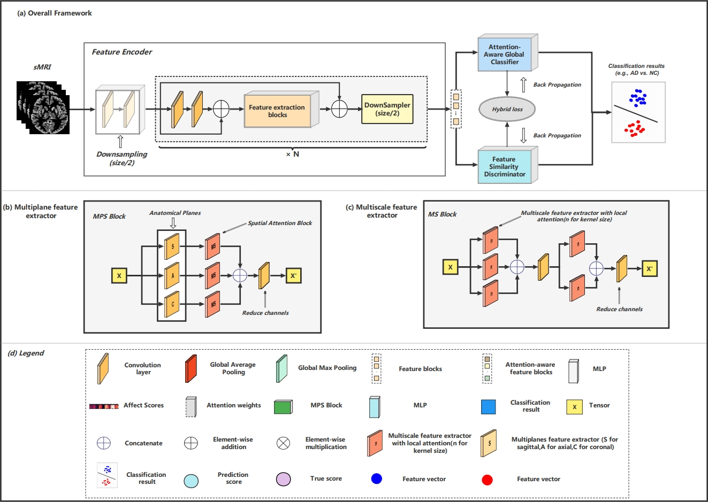

# MPS-FFA: A multiplane and multiscale feature fusion attention network for Alzheimer’s disease prediction with structural MRI

# The pipeline of the MPS-FFA


## Abstract 
Structural magnetic resonance imaging (sMRI) is a popular technique that is widely applied in Alzheimer’s disease (AD) diagnosis. However, only a few structural atrophy areas in sMRI scans are highly associated with AD. The degree of atrophy in patients’ brain tissues and the distribution of lesion areas differ among patients. Therefore, a key challenge in sMRI-based AD diagnosis is identifying discriminating atrophy features. Hence, we propose a multiplane and multiscale feature-level fusion attention (MPS-FFA) model. The model has three components, (1) A feature encoder uses a multiscale feature extractor with hybrid attention layers to simultaneously capture and fuse multiple pathological features in the sagittal, coronal, and axial planes. (2) A global attention classifier combines clinical scores and two global attention layers to evaluate the feature impact scores and balance the relative contributions of different feature blocks. (3) A feature similarity discriminator minimizes the feature similarities among heterogeneous labels to enhance the ability of the network to discriminate atrophy features. The MPS-FFA model provides improved interpretability for identifying discriminating features using feature visualization. The experimental results on the baseline sMRI scans from two databases confirm the effectiveness (e.g., accuracy and generalizability) of our method in locating pathological locations. The source code is available at https://github.com/LiuFei-AHU/MPSFFA.

## Keywords
Alzheimer’s disease, sMRI, Multiplane and multiscale, Attention fusion, Convolutional neural network


## How to run the code
TODO

## How to train
TODO

## How to test
TODO

## Data and Dataset description
TODO


## Citation

If you use Adaptive Teacher in your research or wish to refer to the results published in the paper, please use the following BibTeX entry.

```BibTeX
@article{LIU2023106790,
  title = {MPS-FFA: A multiplane and multiscale feature fusion attention network for Alzheimer’s disease prediction with structural MRI},
  journal = {Computers in Biology and Medicine},
  volume = {157},
  pages = {106790},
  year = {2023},
  issn = {0010-4825},
  doi = {https://doi.org/10.1016/j.compbiomed.2023.106790},
  url = {https://www.sciencedirect.com/science/article/pii/S001048252300255X}
```
F. Liu, H.B. Wang, S.N. Liang, Z. Jin, S.C. Wei, X.J. Li. MPS-FFA: A multiplane and multiscale feature fusion attention network for Alzheimer's disease prediction with structural MRI[J]. Computers in Biology and Medicine, 2023, 157:106790.

